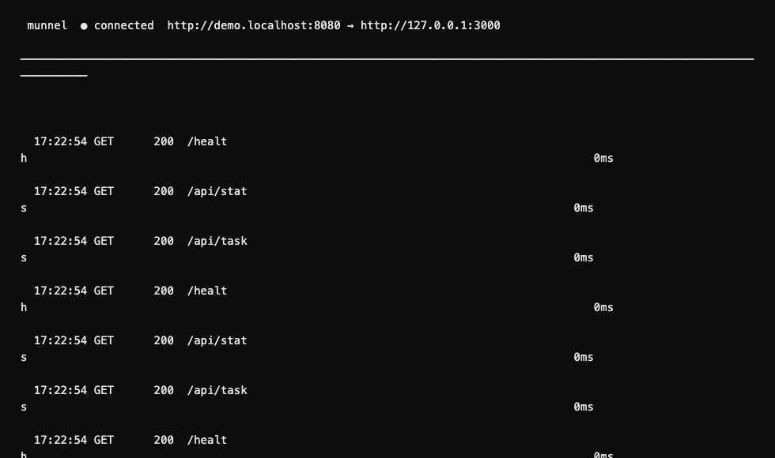
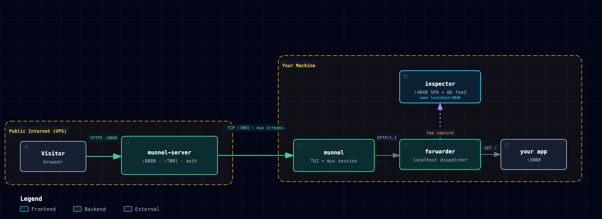
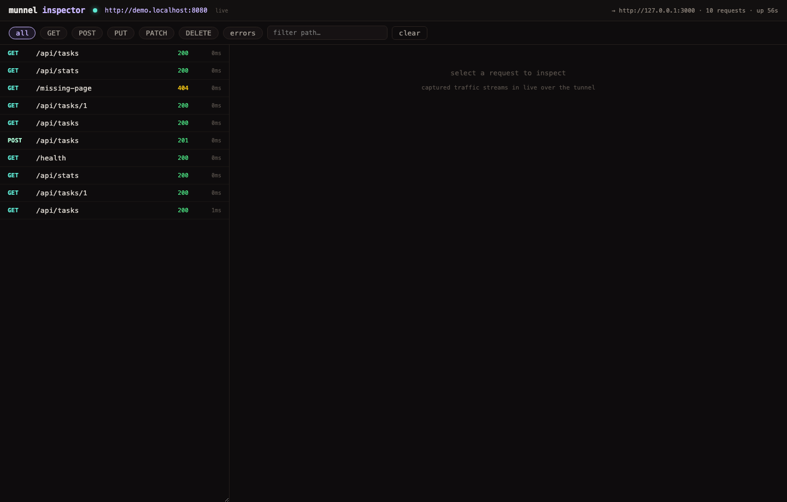
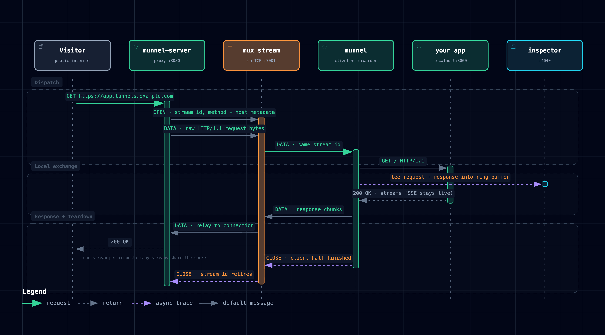
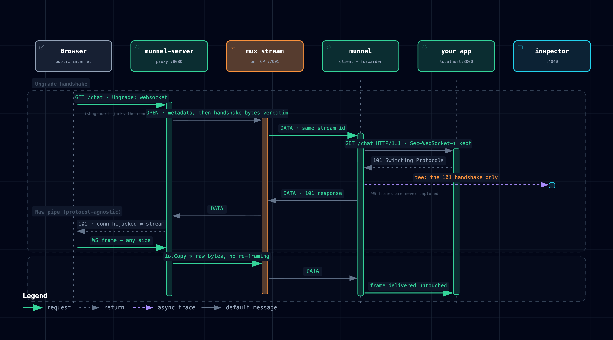

# munnel

a lightweight self-hosted tunneling engine, binary multiplexer, and real-time
request inspection suite. no ngrok accounts, no rate limits, no third-party
cloud lock-in. expose localhost to the public internet instantly.

inspired by [tunneru](https://github.com/pranav718/tunneru), built in the same
spirit: your server, your domain, your tokens.

---

## contents

- [features](#features)
- [architecture](#architecture)
- [quickstart](#quickstart)
  - [1. build](#1-build)
  - [2. run the server](#2-run-the-server)
  - [3. expose a local port](#3-expose-a-local-port)
  - [4. subdomains and token auth](#4-subdomains-and-token-auth)
  - [5. TLS control connection](#5-tls-control-connection)
  - [6. reserved names](#6-reserved-names)
- [CLI reference](#cli-reference)
- [request inspector](#request-inspector)
- [self-hosting in production](#self-hosting-in-production)
- [managed Azure deployment](#managed-azure-deployment)
- [how multiplexing works](#how-multiplexing-works)
  - [websocket and upgrade tunnels](#websocket-and-upgrade-tunnels)
- [limitations](#limitations)
- [project structure](#project-structure)

---

## features

**custom 9-byte binary multiplexer**

- stream multiplexing over a single persistent TCP connection
- compact 9-byte binary frame header (1-byte type, 4-byte stream id, 4-byte length)
- big payloads are chunked transparently into 1 MiB frames
- ping/pong keepalives ride the same framing

**terminal TUI and live telemetry**

- interactive dashboard (bubble tea) with connection status, uptime, request counts
- live request stream: method, path, status code, latency — right in your shell



**web request inspector**

- dark single-page inspector on `127.0.0.1:4040`, served by the client itself
  (loopback only, behind a per-launch access token)
- full request/response inspection: headers, bodies, syntax-highlighted JSON
- one-click **replay**: re-dispatch any captured request to localhost without
  re-triggering the external provider (webhooks from stripe, github, shopify, …)
- websocket live feed — new traffic appears instantly

**security and routing**

- claim predictable subdomains with `-s/--subdomain`
- optional shared token auth (`--auth-tokens`) and per-token reserved subdomains (`--auth-file`)
- HMAC-signed scoped tokens with expiry + revocation (no server-side token list)
- TLS control port (`:7002`, `munnel --tls`) with optional certificate pinning
- reserved names: a subdomain only its listed tokens may claim, and only over TLS
- **zero-trust tunnels** — `--protect` requires viewer login; munnel injects a
  trusted `X-Authenticated-User` header the local service can rely on
- 100 % self-hosted; no external telemetry

---

## architecture

<picture>
  <source media="(prefers-color-scheme: dark)" srcset="docs/diagrams/architecture-dark.png">
  <source media="(prefers-color-scheme: light)" srcset="docs/diagrams/architecture-light.png">
  
</picture>

**[interactive version](docs/diagrams/munnel-architecture.html)** — pan/zoom, focus, dark & light themes

one TCP connection per tunnel carries every request concurrently. the server
parses each public HTTP request, opens a mux stream, writes the request in
HTTP/1.1 wire format, and reads the response the client relayed back from
localhost.

---

## quickstart

### 1. build

```bash
git clone https://github.com/mtufekci/munnel && cd munnel
make build          # → bin/munnel, bin/munnel-server
```

or client-only install:

```bash
./install.sh --client-only
```

### 2. run the server

any linux VPS works (hetzner, digitalocean, fly.io, aws). minimal:

```bash
./bin/munnel-server --domain tunnels.example.com
```

### 3. expose a local port

start your dev server (next.js, rails, fastapi, express — anything HTTP) on
port 3000, then:

```bash
./bin/munnel 3000 --server tunnels.example.com:7001
```

munnel connects, claims a random public URL
(`https://a1b2c3.tunnels.example.com`), opens the TUI, and starts the
inspector on `127.0.0.1:4040` (open the link it prints; it carries the
inspector's access token). if the server has its TLS control port enabled,
prefer `--tls --server tunnels.example.com:7002` (see
[TLS control connection](#5-tls-control-connection)).

> **using a managed server?** if an operator runs munnel for you, get the
> **enrollment password** from them, then self-serve your token:
>
> ```bash
> ./install-dev.sh              # one-time: build + install the client
> munnel token --sub myapp      # one-time: enter the enrollment password → token saved to ~/.munnel/config
> munnel 3000 -s myapp          # day-to-day: that's it
> ```
>
> when your token expires, re-run `munnel token --sub myapp`. no operator
> involvement — the server mints signed, scoped tokens for anyone with the
> enrollment password (see [signed, scoped tokens](#signed-scoped-tokens)).

### 4. subdomains and token auth

```bash
munnel 3000 -s myapp                                   # → myapp.tunnels.example.com
munnel 3000 -s myapp -t secrettoken123 --server tunnels.example.com:7001
munnel 3000 --inspect=false                            # headless mode
```

server side, restrict who may connect:

```bash
munnel-server --domain tunnels.example.com --auth-tokens secrettoken123,friendtoken456
```

or bind tokens to reserved subdomains with an auth file:

```json
// auth.json — {"token": "reserved subdomain"}
{ "secrettoken123": "myapp", "friendtoken456": "friends-app" }
```

```bash
munnel-server --domain tunnels.example.com --auth-file auth.json
```

#### signed, scoped tokens

for per-developer tokens with expiry and revocation — without the server
holding a list of every token — use HMAC-signed tokens. generate a signing
key once, mint tokens for each dev, and revoke by id:

```bash
# 1. generate a signing key (once)
openssl rand -hex 32 > signing.key

# 2. mint a token scoped to the "alice" subdomain, valid 24h
munnel-server mint --sub alice --ttl 24h --key-file signing.key
#   token: tok_a1b2c3d4e5f6a7b8
#   m1.<payload>.<signature>
#   expires: 2026-08-27T15:40:00Z

# 3. run the server with the signing key (+ optional revocation list)
munnel-server --domain tunnels.example.com \
  --signing-key-file signing.key --revoked-file revoked.txt

# 4. the dev connects with their signed token
munnel 3000 -s alice -t m1.<...> --server tunnels.example.com:7001
```

a signed token carries its own subdomain claim and expiry — the server
verifies the signature, so you don't redistribute a token list when someone
joins or leaves. revoke by adding the token id (printed by `mint`) to
`revoked.txt` and restarting. signed and static tokens coexist on the same
server.

#### self-service tokens (`munnel token`)

so devs can mint their own tokens without SSH access to the server, enable
self-service issuance with an enrollment password:

```bash
# operator: set an enrollment password (in .env or --enroll-password)
MUNNEL_ENROLL_PASSWORD=share-this-with-the-team

# dev: acquire a token — prompted for the password, saved to ~/.munnel/config
munnel token --sub alice
#   ✓ token acquired (id tok_...)
#     subdomain: alice
#     expires:   2026-09-03T15:05:14Z
#   ready:  munnel 3000 -s alice

# dev: day-to-day — the saved token is picked up automatically
munnel 3000 -s alice
```

`munnel token` posts to the server's `/__munnel/token` endpoint, which mints
a signed token with the server's own signing key (the key never leaves the
server). tokens default to 7 days and are capped at 30. the enrollment
password is a gate, not a per-dev secret: its only power is minting tunnel
tokens on your domain, and rotating it stops any new issuance. requires
`MUNNEL_SIGNING_KEY` to be set.

#### forward-auth (zero-trust) tunnels

a protected tunnel requires a viewer to log in before any request reaches your
local service — useful for staging sites, internal tools, or preview URLs you
only want your team to see. munnel gates the tunnel at the proxy and, after
login, injects a trusted `X-Authenticated-User` header (and optional
`X-Authenticated-Groups`) that your app can read directly. viewers cannot
spoof these headers: munnel strips them from every incoming request before it
ever sets them.

```bash
# 1. server: enable the stub auth provider (dev/test — trusts any submitted user)
munnel-server --domain tunnels.example.com --auth-stub \
  --session-key-file session.key

# 2. client: opt the tunnel into protection
munnel 3000 -s staging --protect --server tunnels.example.com:7001

# 3. viewers hit https://staging.tunnels.example.com → redirected to a login
#    form → after login, their session cookie authorizes access and your app
#    sees X-Authenticated-User: <whoever they entered>
```

the session cookie is HMAC-signed (`s1.` prefix, same family as signed tokens)
and scoped to the tunnel subdomain. `--auth-stub` is **dev/test only** — it
trusts any username a viewer types. a real OIDC provider is the production
path (the `forwardauth.Provider` interface is the integration point). a tunnel
can also be forced into protection by its signed token: `munnel-server mint
--protect` mints a token whose `prot` claim mandates forward-auth regardless of
the client's `--protect` flag.

### 5. TLS control connection

the control port `7001` is plaintext TCP: the hello (including your token)
and every tunnelled request and response cross the network in cleartext
between your machine and the server. the server can also listen for the same
protocol over TLS on a second port (default `:7002`) once it has a
certificate; `7001` keeps working for clients that have not switched yet.

```bash
# server: reuse the certificate your TLS proxy keeps renewed for the apex domain
munnel-server --domain tunnels.example.com \
  --tls-cert-file /path/to/tunnels.example.com.crt \
  --tls-key-file  /path/to/tunnels.example.com.key      # --control-tls-addr defaults to :7002

# client: verify the server against the system roots
munnel 3000 -s myapp --tls --server tunnels.example.com:7002

# or pin the exact certificate (SHA-256 of its DER), e.g. for a self-signed server
openssl s_client -connect tunnels.example.com:7002 </dev/null 2>/dev/null \
  | openssl x509 -outform DER | openssl dgst -sha256
munnel 3000 --tls --server-cert-sha256 <64 hex chars> --server tunnels.example.com:7002
```

- the server re-reads the certificate files when they change (checked at
  most every 10 s, on a handshake), so a renewal needs no restart. files that
  do not exist yet (the proxy is still obtaining the certificate) are a
  warning, not an error: TLS handshakes fail until they appear.
- `--tls` checks the certificate chain and the host name against the system
  roots. `--server-cert-sha256` replaces that check with an exact match on
  the leaf certificate, which also works for self-signed certificates. a
  Let's Encrypt certificate changes at every renewal (about every 60 days)
  and its pin with it, so prefer plain `--tls` for a publicly trusted
  certificate.
- in `~/.munnel/config`: `tls=true`, `server=tunnels.example.com:7002`
  (`MUNNEL_TLS`, `MUNNEL_SERVER_CERT_SHA256` in the environment). without a
  port, `--tls` assumes `7002`.
- the TLS port reuses the same handshake and mux protocol; only the socket is
  wrapped. the docker setup enables it with two `.env` lines, see
  [deploy/README.md](deploy/README.md#tls-control-port-7002).

### 6. reserved names

a reserved name is a subdomain that only specific signed tokens may claim,
and only over the TLS port. nobody else can squat it while its owner is
offline, and its tunnel never runs over plaintext `7001`. keep its token in a
config that dials the TLS port (`--tls`): the server can refuse a plaintext
hello only after reading it, so a client pointed at `7001` sends the token in
the clear once (then stops, without retrying).

```bash
# mint the owner's token and note its id
munnel-server mint --sub hop --ttl 8760h --key-file signing.key
#   token: tok_0123456789abcdef
#   m1.<payload>.<signature>

# reserved.txt: one "name tokenID[,tokenID...]" per line, # comments allowed
echo "hop tok_0123456789abcdef" >> reserved.txt

munnel-server --domain tunnels.example.com --signing-key-file signing.key \
  --reserved-file reserved.txt --tls-cert-file … --tls-key-file …
```

- the file lists token **ids** (as printed by `mint`), never tokens; it is
  not a secret. a pasted token is refused at startup.
- `$MUNNEL_RESERVED` holds the same entries inline, separated by `;`
  (`hop=tok_0123456789abcdef;staging=tok_…`), for docker `.env` files. it is
  read only when `--reserved-file` is not set.
- every other token is refused the name at the handshake: other signed
  tokens (even ones minted with `--sub hop`), unscoped tokens asking for it,
  static tokens. the listed token is refused over plaintext `7001`, and the
  client stays down instead of resending it on every reconnect.
- `munnel token` / `POST /__munnel/token` refuses to mint a token for a
  reserved name (`403`).
- reserved names need signed tokens (a signing key); an `--auth-file` that
  gives a reserved name to a static token is a startup error.
- like `--revoked-file`, the list is read once: restart the server after
  editing it.

---

## CLI reference

### `munnel` (client)

#### `munnel <port>` — expose a local port

| flag | default | description |
|---|---|---|
| `<port>` | — | local port to expose (positional, required) |
| `-s, --subdomain` | `""` | requested subdomain for public routing |
| `-t, --token` | `""` | authentication token for protected servers |
| `--server` | `localhost:7001` | control server address (`7002` assumed with `--tls` when no port is given) |
| `--tls` | `false` | connect to the server's TLS control port, verifying its certificate |
| `--server-cert-sha256` | `""` | pin the server certificate: hex SHA-256 of its DER (needs `--tls`) |
| `--local-host` | `127.0.0.1` | local service host |
| `--inspect` | `true` | run the web inspector |
| `--inspect-addr` | `127.0.0.1:4040` | inspector listen address (keep it on loopback) |
| `--max-body-mb` | `32` | max request body in megabytes |
| `--protect` | `false` | require viewer login (forward-auth) on this tunnel |

every flag above can also be set from a config file or environment variable, so
day-to-day usage is just `munnel <port> -s <subdomain>`:

| flag | config key | env var |
|---|---|---|
| `--server` | `server` | `MUNNEL_SERVER` |
| `-t, --token` | `token` | `MUNNEL_TOKEN` |
| `-s, --subdomain` | `subdomain` | `MUNNEL_SUBDOMAIN` |
| `--local-host` | `local-host` | `MUNNEL_LOCAL_HOST` |
| `--inspect-addr` | `inspect-addr` | `MUNNEL_INSPECT_ADDR` |
| `--max-body-mb` | `max-body-mb` | `MUNNEL_MAX_BODY_MB` |
| `--inspect` | `inspect` | `MUNNEL_INSPECT` |
| `--tls` | `tls` | `MUNNEL_TLS` |
| `--server-cert-sha256` | `server-cert-sha256` | `MUNNEL_SERVER_CERT_SHA256` |

the config file is `~/.munnel/config` (or `$MUNNEL_CONFIG`), `KEY=VAL` one per
line, `#` comments allowed. precedence: **flag > env var > config file > builtin
default**. `install-dev.sh` writes this file for you with the managed server's
address and token.

#### `munnel token` — acquire a token

| flag | default | description |
|---|---|---|
| `--sub <name>` | `""` | subdomain to scope the token to (empty = any free subdomain) |
| `--ttl <duration>` | `168h` | token lifetime; the server caps at `720h` (30 days) |
| `--password <pw>` | prompted | enrollment password (or `$MUNNEL_ENROLL_PASSWORD`) |
| `--server <host:port>` | config | control server address |
| `--server-url <url>` | derived | proxy base URL (default: `https://<server-host>`, or `http://localhost:8080` for localhost) |

the acquired token is saved to `~/.munnel/config` (replacing any previous
`token=` line) and used automatically by `munnel <port>`. re-run when it
expires.

### `munnel-server`

| flag | default | description |
|---|---|---|
| `--domain` | `localhost` | base domain for tunnel routing |
| `--control-addr` | `:7001` | control + multiplex listening address (plaintext) |
| `--control-tls-addr` | `:7002` | control + multiplex over TLS; listens only when a certificate is configured |
| `--tls-cert-file` | `""` | PEM certificate for the TLS control port; re-read when it changes |
| `--tls-key-file` | `""` | PEM private key for `--tls-cert-file` |
| `--proxy-addr` | `:8080` | public HTTP ingress address |
| `--auth-tokens` | `""` | comma-separated valid client tokens |
| `--auth-file` | `""` | JSON file mapping tokens → reserved subdomains |
| `--signing-key-file` | `""` | file with the HMAC key for signed, scoped tokens (or `$MUNNEL_SIGNING_KEY`) |
| `--revoked-file` | `""` | file of revoked signed-token ids (one per line); reload requires restart |
| `--reserved-file` | `""` | reserved names, `name tokenID[,tokenID…]` per line (or `$MUNNEL_RESERVED`, `;`-separated); claimable only by those tokens, only over TLS; reload requires restart |
| `--auth-stub` | `false` | enable the stub forward-auth provider (dev/test only — trusts any user; **not for production**) |
| `--session-key-file` | `""` | HMAC key for forward-auth session cookies (or `$MUNNEL_SESSION_KEY`; ephemeral if unset with `--auth-stub`) |
| `--enroll-password` | `""` | password gating self-service token issuance via `POST /__munnel/token` (or `$MUNNEL_ENROLL_PASSWORD`; requires signing key) |
| `--public-scheme` | `http` | URL scheme (use `https` behind Caddy/Cloudflare) |
| `--public-port` | `""` | port in generated URLs (defaults to the proxy port; set `443` behind a TLS proxy so clients see clean `https://sub.domain` URLs) |
| `--max-body-mb` | `32` | max request body in megabytes |

---

## request inspector

while a tunnel runs, open the inspector link munnel prints at startup
(`http://127.0.0.1:4040/?t=<token>`, also shown in the TUI):



- **request stream** — live list with method, path, status, latency
- **filters** — by method or errors, plus text search on the path
- **inspection** — request/response bodies with JSON formatting and
  syntax highlighting, full header tables
- **replay** — click `↻ replay` to re-send a captured request to your local
  server; the fresh exchange is captured as a new entry (marked `replay`)

the inspector state lives in an in-memory ring buffer (200 requests) and is
cleared when the client exits.

the inspector holds full captured requests and can replay them against your
app, so it is locked down:

- it listens on `127.0.0.1:4040` by default, not on every interface.
- it answers only requests addressed to itself (`Host` must be
  `127.0.0.1:<port>`, `localhost:<port>` or `[::1]:<port>`), which stops DNS
  rebinding; cross-origin writes and websocket connections are refused.
- every route needs a random token created at each launch. opening the
  printed link stores it in an `HttpOnly`, `SameSite=Strict` cookie and
  drops it from the address bar. scripts send it as
  `X-Munnel-Inspector-Token`. a restart makes old links and cookies invalid.
- the non-interactive log prints paths without their query string, so
  `?code=` and signed-URL parameters never end up in log files.

---

## self-hosting in production

1. **DNS** — point both the apex and the wildcard at your VPS:

   ```
   tunnels.example.com     A    <vps-ip>
   *.tunnels.example.com   A    <vps-ip>
   ```

2. **run the server** — docker:

   ```bash
   MUNNEL_DOMAIN=tunnels.example.com MUNNEL_TOKENS=secret123 \
   MUNNEL_SCHEME=https docker compose up -d
   ```

3. **TLS** — the server speaks plain HTTP; terminate TLS in front. the
   included `docker-compose.yml` runs Caddy alongside the server and a tiny
   `ask` permission endpoint. Caddy obtains the apex certificate on startup
   and a per-subdomain Let's Encrypt certificate on each `*.tunnels.example.com`
   subdomain's first request (on-demand TLS). the `ask` service (see
   `approve.py`) gates issuance to your own domain only — Caddy v2.8+
   requires a permission module for on-demand TLS. no DNS-provider plugin
   or wildcard certificate is needed. with the stack running, clients use:

   ```bash
   munnel 3000 -s myapp -t secret123 --server tunnels.example.com:7001
   ```

4. **hardening** — always set `--auth-tokens` (or `--auth-file`) on a public
   server; otherwise anyone who finds it can host content through your domain.
   the control port (7001) must be reachable from clients, and it is
   **plaintext**: each client's token, and every request and response it
   tunnels, cross the network unencrypted between the client and the server.
   enable the TLS control port (7002, see
   [TLS control connection](#5-tls-control-connection)) and move clients to
   `--tls`; reserve sensitive names so they can only be claimed over TLS. you
   can additionally firewall 7001 to known IPs, or close it once every client
   has switched.

---

## managed Azure deployment

a production-grade managed instance for devs is documented in
[docs/OPERATIONS.md](docs/OPERATIONS.md) — an isolated resource group
(`rg-munnel-dev-westeurope`), a Ubuntu VM running the server behind Caddy with
on-demand TLS, Log Analytics + alerts, and an operator runbook (SSH access,
token rotation, redeploy, troubleshooting). the `docker-compose.yml` and
`approve.py` in this repo are the shape that deployment runs.

redeploys can be triggered manually from the **Actions** tab via the `Deploy
server` workflow (`.github/workflows/deploy-server.yml`) — a self-hosted
runner on the VM checks out the source, rebuilds the Docker image, runs a
health check, and never touches the live `.env` secrets. see the runbook §6
for one-time runner setup.

---

## how multiplexing works

munnel multiplexes every concurrent HTTP exchange across one persistent TCP
socket using a 9-byte binary frame header:

**`type` (1 B) · `stream id` (4 B, big-endian) · `payload length` (4 B) · payload (≤ 1 MiB per frame)**

<picture>
  <source media="(prefers-color-scheme: dark)" srcset="docs/diagrams/lifecycle-dark.png">
  <source media="(prefers-color-scheme: light)" srcset="docs/diagrams/lifecycle-light.png">
  
</picture>

**[interactive version](docs/diagrams/munnel-request-lifecycle.html)** — step through dispatch, the local exchange, and teardown

| type | byte | meaning |
|---|---|---|
| `OPEN` | `0x01` | open a stream (payload: json metadata) |
| `DATA` | `0x02` | stream payload bytes |
| `PING` / `PONG` | `0x03` / `0x04` | keepalive / RTT |
| `CLOSE` | `0x05` | sender finished writing (half-close) |
| `RESET` | `0x06` | abort the stream immediately |

stream ids use parity (server: odd, client: even), so either side may open
streams without coordination. `CLOSE` is directional — the peer sees `EOF`
while remaining free to write — which maps cleanly onto request → response.
`RESET` works in any state, including after `CLOSE`: when a public viewer
disconnects mid-response (a closed SSE tab), the server resets the stream and
the client closes its connection to your app, so the app sees the viewer
leave instead of holding an idle stream open.

liveness: each side pings every 15 s and closes the session after 45 s
without receiving a single byte (pongs count, and so does a large frame still
trickling in over a slow link), so a client that vanished without closing the
socket (laptop asleep, NAT timeout) releases its subdomain. a client
reconnecting with the same signed token takes its name over, closing the old
session, as soon as that session has missed a heartbeat (nothing received for
1.5 ping intervals, about 23 s); a session that still answers pings keeps its
name, so a token sniffed on the plaintext port cannot evict a live tunnel. the proxy answers `504` if the client relays no
response headers within 60 s; streaming bodies after the headers are not
limited.

1. public traffic arrives at the proxy (`:8080`); the host header selects a
   tunnel from the registry
2. the proxy opens a stream on that tunnel's session and writes the raw
   HTTP/1.1 request
3. the client decodes frames by stream id, dispatches to `localhost:<port>`,
   and writes the raw response back — responses stream (tee'd into the
   inspector), so SSE and large downloads stay live end-to-end
4. `CLOSE` frames from both sides retire the stream

the control handshake happens before the first binary frame: one JSON `hello`
(token, requested subdomain) and one JSON `ack` (assigned public URL), each on
its own newline-terminated line, then the socket switches to binary frames
exclusively. both ends read exactly one line, never through a buffering JSON
decoder, so the first frame after the ack is never shifted by a stray byte.

### websocket and upgrade tunnels

requests carrying `Connection: Upgrade` (WebSocket, h2c, etc.) skip the framed
request/response path entirely — the server hijacks the public connection and
pipes it raw over one mux stream:

<picture>
  <source media="(prefers-color-scheme: dark)" srcset="docs/diagrams/websocket-dark.png">
  <source media="(prefers-color-scheme: light)" srcset="docs/diagrams/websocket-light.png">
  
</picture>

**[interactive version](docs/diagrams/munnel-websocket-upgrade.html)** — see the hijack boundary and where capture stops

- the upgrade handshake (including `Sec-WebSocket-*` headers) is replayed
  verbatim; the local app sees the request exactly as the browser sent it
- after `101 Switching Protocols`, two `io.Copy` goroutines shuttle raw bytes
  in both directions — arbitrary frame sizes, no re-framing, no buffering caps
- the inspector records only the `101` handshake; individual WS frames are not
  captured and upgrade requests cannot be replayed

---

## limitations

- **HTTP(S) + WebSocket only.** raw TCP tunnels (databases, ssh) are not carried
  — there is no HTTP handshake to bootstrap them.
- request bodies are buffered up to `--max-body-mb` on both ends; responses
  stream without a cap.
- inspector capture is truncated at 256 KiB per body for display (proxying is
  unaffected); truncated request bodies cannot be replayed.
- a local app must send response headers within 60 s (after that the viewer
  gets `504`); long polls should send headers first and stream the body.
- a second client started with the same signed token is refused ("in use")
  while the first is up, and gets the name only once the first stops
  answering pings; run one per token.

---

## project structure

```
munnel/
├── cmd/
│   ├── client/
│   │   ├── main.go             # munnel — CLI entry point
│   │   ├── defaults.go         # ~/.munnel/config + MUNNEL_* env defaults (flag > env > config > builtin)
│   │   └── defaults_test.go    # config parsing, env-over-config precedence, edge cases
│   └── server/
│       └── main.go             # munnel-server — CLI entry point (flags, mint subcommand)
├── internal/
│   ├── mux/                    # 9-byte binary multiplexer
│   │   ├── frame.go            #   wire format encode/decode
│   │   ├── session.go          #   session manager, heartbeat, dispatch
│   │   ├── stream.go           #   per-stream net.Conn implementation
│   │   └── mux_test.go         #   unit + concurrency tests (-race clean)
│   ├── proto/
│   │   └── message.go          # handshake wire messages, subdomain rules
│   ├── server/
│   │   ├── auth.go             # token auth (static + signed) + reserved subdomains + reserved names
│   │   ├── control.go          # control listener, handshake, registration
│   │   ├── registry.go         # thread-safe subdomain → tunnel registry (same-token takeover)
│   │   ├── certfile.go         # TLS control-port certificate, reloaded when the files change
│   │   ├── proxy.go            # public HTTP ingress + request/WebSocket relay + forward-auth
│   │   └── landing.go          # landing page on the bare domain
│   ├── token/
│   │   ├── token.go            # signed, scoped tunnel tokens (HMAC-SHA256); Mint/Parse/IDOf
│   │   └── token_test.go       # token signing, parsing, tamper/expiry rejection
│   ├── forwardauth/
│   │   ├── forwardauth.go      # zero-trust: session cookies, identity injection, login flow
│   │   └── forwardauth_test.go # session cookie sign/verify, header stripping, spoof rejection
│   ├── client/
│   │   ├── config.go           # client settings
│   │   ├── tunnel.go           # reconnect loop, session wiring, events
│   │   └── forwarder.go        # localhost dispatcher + traffic capture + WebSocket relay
│   ├── inspection/
│   │   ├── store.go            # ring buffer of captured exchanges
│   │   ├── hub.go              # websocket fan-out to inspector tabs
│   │   ├── server.go           # inspector HTTP API + replay endpoint
│   │   └── web/index.html      # embedded single-page inspector UI
│   └── tui/
│       ├── tui.go / model.go   # bubble tea dashboard
│       └── styles.go           # palette
├── integration/                # end-to-end tests (real in-process server + client)
│   ├── e2e_test.go             # basic tunnel round-trip
│   ├── shutdown_test.go        # ctx shutdown (idle + mid-stream) — verified to fail with fix reverted
│   ├── websocket_test.go       # WebSocket tunnel end-to-end (hijack → raw pipe)
│   ├── token_auth_test.go      # signed + static token auth, scoped subdomains
│   ├── token_issue_test.go     # self-service issuance (POST /__munnel/token)
│   ├── tls_test.go             # TLS control port, certificate pin, reserved names
│   ├── liveness_test.go        # dead peer, same-token takeover, 504, viewer disconnect closes local SSE
│   ├── handshake_test.go       # handshake line framing at 64/128/256…-byte hellos
│   ├── inspector_test.go       # inspector Host/Origin allowlist + per-launch token
│   └── forwardauth_test.go     # protected tunnels: redirect, login, header injection, spoof stripping
├── deploy/                     # cross-provider provisioning scripts
│   ├── README.md               # deploy guide (why scp, provider prerequisites)
│   ├── cloud-init.yaml         # portable user-data (Docker + .env + systemd unit)
│   ├── lib.sh                  # shared deploy helpers (render_user_data, wait_ssh, ship_and_start)
│   ├── azure/                  # Bicep (main.bicep) + deploy.sh
│   ├── aws/                    # CloudFormation (cloudformation.yaml) + deploy.sh
│   ├── gcp/                    # deploy.sh (gcloud)
│   ├── digitalocean/           # deploy.sh (doctl)
│   └── hetzner/                # deploy.sh (hcloud)
├── .github/workflows/
│   └── deploy-server.yml       # manual workflow_dispatch: test + deploy via self-hosted runner on the Azure VM
├── docs/
│   ├── OPERATIONS.md           # managed Azure deployment + operator runbook
│   ├── images/                 # README screenshots (inspector + terminal TUI)
│   └── diagrams/               # archify diagrams (HTML viewer + dark/light PNG exports)
│       ├── munnel-architecture.*      # tunnel topology
│       ├── munnel-request-lifecycle.* # frame-level request lifecycle
│       └── munnel-websocket-upgrade.* # WS upgrade hijack + raw pipe
├── Dockerfile                  # multi-stage server image (scratch)
├── docker-compose.yml          # production shape: server + caddy + ask (TLS)
├── approve.py                  # caddy on-demand TLS permission endpoint
├── Caddyfile.example           # on-demand TLS reverse proxy template
├── .env.example                # MUNNEL_DOMAIN / MUNNEL_TOKENS / MUNNEL_SCHEME / signing key / auth stub
├── Makefile                    # build / test / cross-compile
├── install.sh                  # source installer (builds client + server)
├── install-dev.sh              # one-command dev setup for a managed server
├── go.mod / go.sum             # module github.com/mtufekci/munnel, Go 1.25
├── AGENTS.md                   # AI agent orientation (repo map, conventions, invariants)
└── README.md
```
